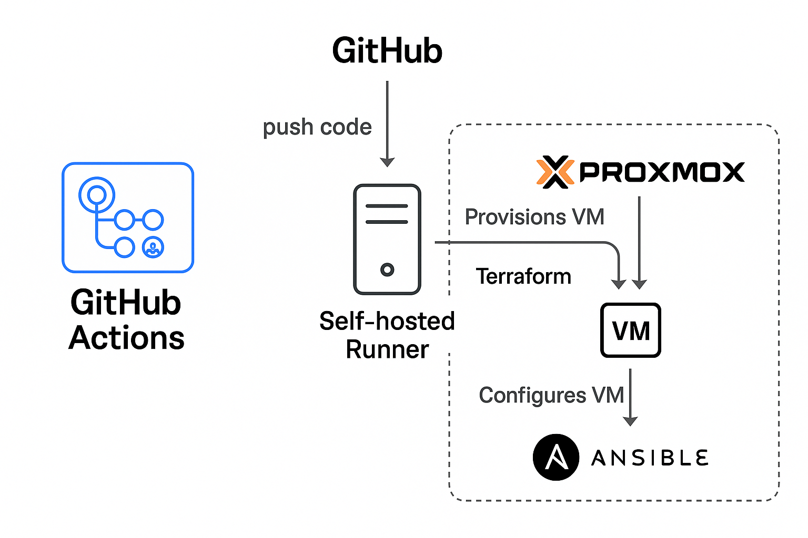

## GitHub Actions CI/CD Pipeline for Proxmox VM Automation

[](https://github.com/charliemiller140/proxmox-pipeline-lab/actions)

## Proxmox VM Automation with CI/CD

This project lets you **automatically provision and configure Ubuntu virtual machines** on your **Proxmox VE** host using **Terraform**, **Cloud-Init**, and **Ansible**, fully driven by **GitHub Actions**.

This repository gives you a **real-world CI/CD pipeline** for Infrastructure as Code inside a private network with **push-to-deploy VM provisioning**, SSH key injection, static IP configuration, and automated software setup.

---

## Project Overview



- **Terraform** provisions VMs on Proxmox by cloning a prepared cloud-init template.
- **Cloud-Init** injects SSH keys and optional static IP configurations.
- **GitHub Actions** triggers deployments via `push` events.
- **Ansible** connects post-provisioning to configure and prepare the VM.
- Pipeline completes unattended from repo push to running server.

---

## Stack Used

| Tool             | Role                                     |
|------------------|------------------------------------------|
| **Terraform**    | VM provisioning on Proxmox               |
| **Ansible**      | Post-provision setup (e.g. packages, SSH)|
| **GitHub Actions** | CI/CD orchestrator                     |
| **Cloud-Init**   | Initial user + SSH key injection         |
| **Proxmox VE**   | Hypervisor platform                      |

---

## Directory Structure

```text
.
├── .github/
│   └── workflows/
│       └── deploy.yml         # GitHub Actions pipeline
├── terraform/
│   ├── main.tf                # VM provisioning logic
│   ├── variables.tf           # Inputs
│   ├── terraform.tfvars       # Variable values (API, keys, etc.)
│   └── user_data.yml          # Cloud-init config
├── ansible/
│   ├── inventory.ini          # Dynamic/static inventory
│   └── playbooks/
│       └── base-config.yml    # Playbook run post-provision
├── README.md
````

---

## Getting Started

### 1. Proxmox Setup

Create a Proxmox API token with appropriate permissions, then add the following as **GitHub Secrets**:

| Secret Name            | Description                                 |
| ---------------------- | ------------------------------------------- |
| `PROXMOX_API_URL`      | e.g. `https://X.X.X.X:8006/api2/json` |
| `PROXMOX_USER`         | e.g. `terraform@pam`                        |
| `PROXMOX_TOKEN_ID`     | Token ID (e.g. `terraform-token`)           |
| `PROXMOX_TOKEN_SECRET` | Token secret                                |

---

### 2. SSH Keys for Ansible

Generate a keypair to allow Ansible to log in:

```bash
ssh-keygen -t rsa -b 4096 -f ~/.ssh/ansible_ci_key
```

* Add the **private key** as `ANSIBLE_PRIVATE_KEY` in GitHub Secrets.
* The **public key** goes into:

  * Your `user_data.yml` file for cloud-init
  * Or into Terraform under `sshkeys`

---

### 3. Network Requirements

Ensure:

* The Proxmox bridge (e.g. `vmbr0`) is connected to a trunk port if using VLANs.
* A DHCP server is active (or a static IP is defined).
* Your cloud-init template has the `cloud-init` drive attached.

---

## Key Highlights & Tips

### Dynamic VM Naming

Terraform appends a timestamp to avoid naming collisions:

```hcl
name = "lab-vm-${formatdate("YYYYMMDDhhmmss", timestamp())}"
```

---

### What Is a Runner (and Why You Need One for Proxmox)?

GitHub Actions executes workflows on **runners** these are the machines that perform your CI/CD tasks.

By default, workflows run on GitHub-hosted runners like `ubuntu-latest`. But those runners **can’t access a private homelab Proxmox server** because:

* They’re in the cloud (no access to your LAN)
* Proxmox is on your **internal/private network** behind NAT

#### Solution: Self-Hosted Runner

To connect GitHub Actions with Proxmox securely, this project uses a **self-hosted runner** a lightweight GitHub agent you install on a machine **inside your network** (e.g. your Proxmox server, a VM, or a Raspberry Pi).

This allows the GitHub workflow to:

* Access your **Proxmox API**
* SSH into newly created VMs
* Run `terraform` and `ansible` from inside your network

---

#### 🔧 How the Self-Hosted Runner Works

1. You register a runner on GitHub from your local machine:

   ```bash
   ./config.sh --url https://github.com/YOUR_USERNAME/YOUR_REPO --token ABC123
   ```

2. It polls GitHub for jobs.

3. When you `git push`, GitHub triggers your `deploy.yml`, and the **job is executed on your local runner**.

4. From inside your network, the runner can:

   * Talk to `https://X.X.X.X:8006/api2/json` (Proxmox)
   * Connect to VMs via SSH
   * Access local secrets or mounted volumes if needed

---

#### Why This Matters

Without a self-hosted runner:

* GitHub-hosted runners can’t reach Proxmox or your private network.
* Terraform will fail to connect to the API.
* Ansible won’t reach your VMs over SSH.

Using a **self-hosted runner bridges GitHub and your local environment securely**.

---

### Static IP or DHCP via Cloud-Init

```hcl
ipconfig0 = "ip=X.X.X.X/X,gw=X.X.X.X"
# or
ipconfig0 = "ip=dhcp"
```

---

### Wait for SSH Before Ansible

Optional improvement: wait for SSH to become available:

```bash
for i in {1..20}; do
  if ssh -i id_rsa ubuntu@X.X.X.X "echo ok"; then break; fi
  sleep 10
done
```

---

### Common Pitfalls I experienced 

* ❗ **Cloud-init not working**: Ensure the Proxmox template has the cloud-init drive (`ide2`).
* ❗ **SSH connection fails**: Confirm public key used in Terraform matches private key in Ansible secret.
* ❗ **Ping fails on VLANs**: Your switch must trunk the correct VLANs to Proxmox and/or tag the vm with the correct VLAN.
* ❗ **No IP?**: Ensure there's a DHCP server or assign a static IP.
* ❗ **Making sure my configuration syntax for Proxmox API was correct**: Read the documentation correctly.

---

## Improvements

* [ ] Support multi-VM creation via Terraform `count`.
* [ ] Parametrize Proxmox node name, bridge, VLAN tag.
* [ ] Add teardown (destroy) pipeline trigger.
* [ ] Add health check or monitoring agent (e.g. Node Exporter).
* [ ] Create webpage for pushing code and monitoring etc.

---

## About

This project was developed to improve infrastructure automation, CI/CD workflows, and GitHub Actions experience in a real-world homelab environment. Contributions, suggestions, or questions are welcome!

You can explore more projects at: [github.com/charliemiller140](https://github.com/charliemiller140)
